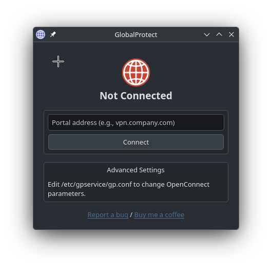

# Global Protect Unofficial Software for Linux

## About

An unofficial GlobalProtect VPN client for Linux that uses openconnect, providing a Qt6-based GUI for connecting to GlobalProtect VPNs.

I was using [GlobalProtect-openconnect](https://github.com/yuezk/GlobalProtect-openconnect) until it stopped working with an upgrade made to my university's VPN server. This project is a ground-up alternative to the excellent work made by Yuezk with a different approach to the GUI.

The software is organized into two main components:

1. **gpservice**: A system service that manages the VPN connection using openconnect in the background.
2. **gpclient**: A Qt6-based GUI application that interacts with gpservice to provide a user-friendly interface for connecting to GlobalProtect VPNs.

Here is how the GUI looks like:



The GUI is minimalistic. I prefer to keep it simple and avoid unnecessary features.

## Installation

### Ubuntu/Debian

1. Download the `.deb` package from TODO: LINK
2. Install using gdebi:
```bash
sudo apt install gdebi-core
sudo gdebi globalprotect-openconnect_0.0.1_amd64.deb
```

### Fedora/RedHat

1. Download the `.rpm` package from TODO: LINK
2. Install using dnf:
```bash
sudo dnf install globalprotect-openconnect-0.0.1-1.fc39.x86_64.rpm
```

### Manjaro/Arch

```bash
# Clone the repository
git clone https://github.com/pachadotdev/globalprotect-linux.git
cd globalprotect-linux

# Build and install using makepkg
makepkg -si
```

Alternatively, building from source following [build.md](build.md) instructions.

## Usage

After installation, enable and start the service:

```bash
sudo systemctl enable --now gpservice
```

Then launch the GUI client by opening "GlobalProtect" in your application menu or by running:

```bash
gpclient
```

## Uninstallation

### Ubuntu/Debian

```bash
sudo systemctl stop gpservice
sudo systemctl disable gpservice
sudo apt remove globalprotect-openconnect
```

### Fedora/RedHat

```bash
sudo systemctl stop gpservice
sudo systemctl disable gpservice
sudo dnf remove globalprotect-openconnect
```

### Arch/Manjaro

```bash
sudo systemctl stop gpservice
sudo systemctl disable gpservice
sudo pacman -R globalprotect-openconnect-git
```

## License

Apache License 2.0.
